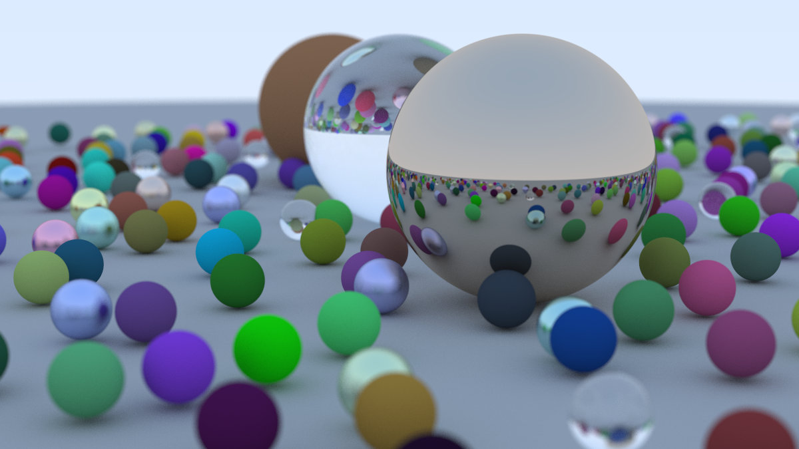

# Rust Ray Tracer

<!-- toc -->

- [Project structure](#project-structure)
- [Building the binaries](#building-the-binaries)
- [Renderings](#renderings)
  * [Book 1 end](#book-1-end)

<!-- tocstop -->

This repository contains rust code for the book [Ray Tracing in One Weekend](https://raytracing.github.io/books/RayTracingInOneWeekend.html).

It is not meant to be an optimised version of the ray tracer. I followed this book to learn the Rust programming language. I have made sure to replicate the various logics presented throughout the book.

## Project structure

- src/ : contains the code for various ray tracer primitives like Ray, Color, Camera etc.
  - bin/ : contains binary code for chapter outputs
  - README.md : chapter wise notes of important definitions and concepts

## Building the binaries

You have to build each binary in the src/bin directory separately.

```bash
cargo run --release --bin <BINARY_FILE_NAME_WITHOUT_EXTENSION> > <OUTPUT_FILE_NAME>.ppm
```

Example-

```bash
cargo run --release --bin section_14 > final_scene.ppm
```

## Renderings

### Book 1 end


